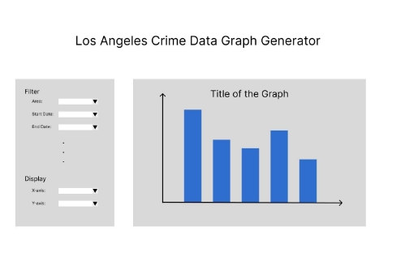

**LA Crime Observation by team055-ABCD**

1. The data that we are trying to access and store is the criminal records from Los Angeles. We will be storing the
   1. Division of Records Number, which is made up of a 2-digit year, area ID, and 5 digits that signify different crimes i.e. this will be out the primary key
   1. date reported
   1. date occurred
   1. time occurred
   1. area ID
   1. area name
   1. reporting district
   1. crime code
   1. crime description
1. The goal is to merge records of crimes in Los Angeles from two separate year intervals in order to give the viewer a good idea of the frequency and the location of the crimes happening. We are also planning on implementing a feature that allows users to toggle and compare the records between different years.
1. One creative element we plan on implementing is an actual map, which locates the intensity of crime by placing different color markings for different areas. The map will be color-coded, with red denoting high crime rates, yellow denoting moderate crime rates, and green denoting low crime rates. This will help the viewers figure out the areas and frequency of crime in the area based on the last 2 years' records.
1. Project title - LA Crime Observation
1. Our project is to fetch data from the LAPD website regarding crimes committed in Los Angeles. We plan on utilizing the database made available to us by the government of Los Angeles, which is an open website available to everyone - [data.lacity.org](https://data.lacity.org/Public-Safety/Crime-Data-from-2010-to-2019/63jg-8b9z). We plan on using details like date, time, area, and type of crime to help the people of LA determine and pinpoint areas of repeated crimes. We plan on fetching all data from the year 2010 to the current time with the exception of 2019 due to the lack of data regarding the year. This will be done using two separate datasets, which we will be unioning to achieve a bigger more detailed record of crimes.

When it comes to functionality, the users will be able to do anything ranging from checking the details on a specific time to being able to compare separate years. We plan on implementing a map that shows people what areas to avoid at what specific times by looking at the frequency of crime in the past. The map will be color-coded, with red denoting high crime rates, yellow denoting moderate crime rates, and green denoting low crime rates. This will make it easier for users to understand the crime rates in

different areas at a glance. We believe that comparing two years’ of crimes will provide all viewers insight into the changes in trends between any two years. In addition to the crime rates, users will also be able to access information on specific types of crimes, such as theft, assault, and burglary. This website will be a very useful resource to not only the citizens but the police as well because they will really be able to track all the trends. This will help them see how the trends have changed with time and what areas have become more or less prone to crime, and it will help the LAPD to allocate their resources more effectively, ensuring that they are deployed to the areas where they are most needed.

6. The reason we are trying to create this website is so the people of Los Angeles have a reliable database and visualization of crime areas that they can use to figure out how safe the areas they are currently in or want to go to are. In addition to providing data, our app will also create visualizations (graphs) of the data as well as provide conclusions based on analysis of the data. This solves the problem that the crime data of LAPD is too extensive and complex for regular citizens to understand. For our project architecture, we will create a database with tables that is parsed from the LA Crime datasets. We will retrieve the information from the database and send it to the front end of our application, where we will create visualizations of the LA Crime data.
6. Our information regarding the past and current situations in the area can help citizens stay safe. Our app may even be useful for government officials to see how crime trends have changed throughout the years. Our chosen application is useful because it provides a comprehensive view of crime data in Los Angeles. Users are able to access and compare crime records between different years, making it easier for them to understand the trends and changes in crime in the city. A website like this is useful because it empowers individuals and organizations with the ability to access and understand crime data in a clear and concise manner. This information can be used to make informed decisions, such as choosing a safe neighborhood to live in or deploying police resources effectively to areas with higher crime rates.

In comparison to other websites, there are similar websites that provide crime information in specific areas such as CrimeReports.com, SpotCrime.com, and Citizen Observer. These websites also merge records of crimes and report the frequency and location of the crimes happening. However, what sets our application apart is the ability to compare crime records between different years and the use of a map to clearly illustrate the crime intensity in different areas.

What other websites have done:

- Merges records of crimes and reports the frequency and location of the crimes happening
- Provides up-to-date crime information to the public
- Uses data collected from reliable sources, such as the police department
- Allows users to search for crime information in specific areas
- Helps increase public safety awareness and preparedness.

What makes us different from other websites:

- Merges two separate year intervals for crime records
- Focuses solely on crime records in Los Angeles
- Allows users to toggle and compare crime records between different years. They give actual crime data for a specific area.
- Provides a map that locates the intensity of crime with color markings
- Provides information on specific types of crimes, not just the overall crime rate
- Compares and analyzes crime trends over time
- Helps the police department allocate resources more effectively
8. Our data is the crimes that happened in Los Angeles from 2010 to the present. We collected our data from the Los Angeles Open Data website, which contains reliable information recorded by the Los Angeles police department. We will primarily use two tables from the website, the first one containing crime data from 2010 to 2019 (<https://data.lacity.org/Public-Safety/Crime-Data-from-2010-to-2019/63jg-8b9z>), and the second containing crime data from 2020 to present ([https://www.kaggle.com/datasets/susant4learning/crime-in-los-angeles-data-from-2020-t o-present](https://www.kaggle.com/datasets/susant4learning/crime-in-los-angeles-data-from-2020-to-present)).
8. Users will be able to generate graphs based on the data provided in the merged database. Users can filter certain results and Choose the X and Y axis of the graph. We also provide the option to generate a report for any area, including its crime rate, dangerous subregions, police patrol advice, etc. For example, they can see how the number of crimes increases or decreases in a certain region during the 12-year interval.

- UI mockup:

Work distribution:

Database creation: Aditya Patel / Rohan Gudipaty 
Backend (retrieve data from database): Aditya Patel 
Backend (send data to frontend): Rohan Gudipaty 
Frontend (graph): Tianyue Cao
Frontend (area report): Diego Saavedra
